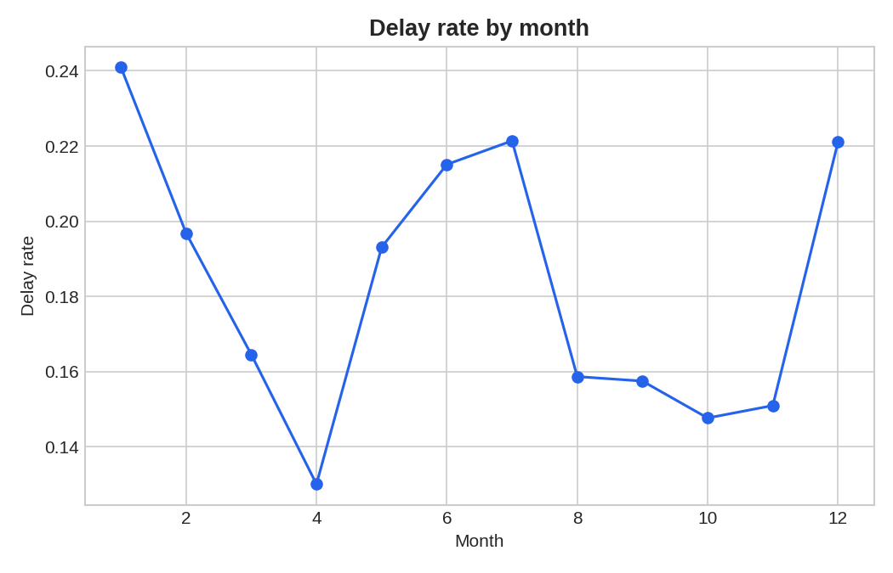
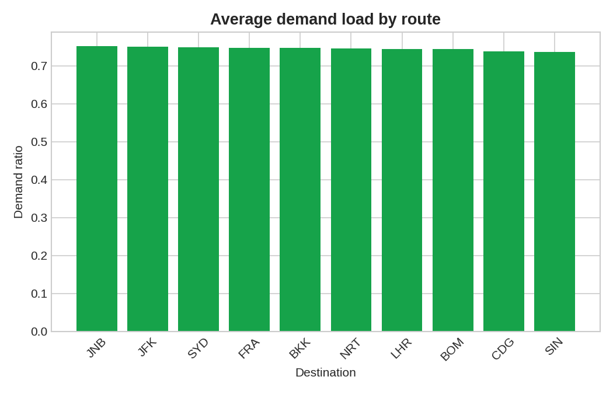
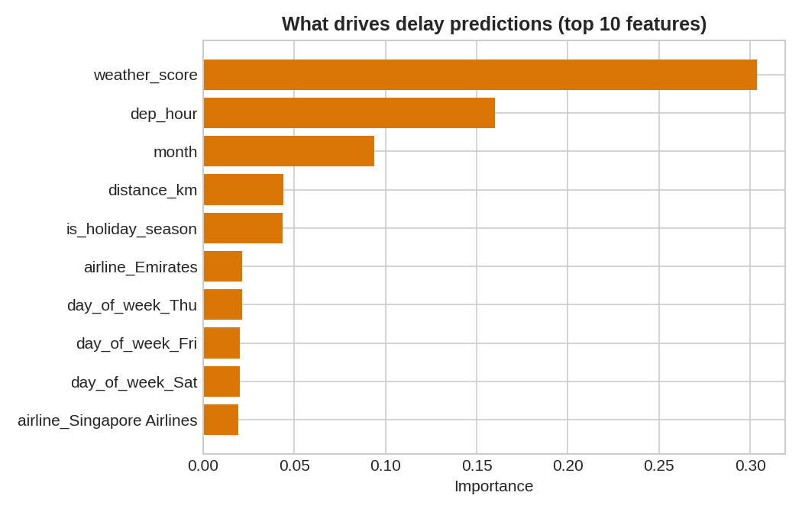

# Flight Delay & Demand Predictor

A machine learning project predicting **flight delay likelihood** and **passenger demand** for
Dubai (DXB) hub routes, with an interactive dashboard for exploring the predictions.

🔗 **Live demo:** [Try the live demo](https://flight-predictor-upyjnyjzncjggsbd3qrjmx.streamlit.app/)_

Built as a portfolio project targeting aviation/airline data roles (e.g. Emirates Group)
— re-purposed from a general sales-prediction pipeline into an aviation-specific one.

## What it does

- **Delay classifier**: predicts the probability a flight is delayed, based on airline,
  route, month, day, departure hour, weather, and holiday season.
- **Demand regressor**: predicts expected booking load (as a % of seat capacity) for the
  same inputs — a proxy for how airlines think about dynamic pricing.
- **Dashboard**: an interactive Streamlit app where you set flight parameters and get
  live predictions, plus exploratory charts (delay rate by month/hour, demand by route,
  feature importance, seasonal pricing patterns).

## Sample output

**Live prediction inputs** (sidebar: airline, route, month, day, hour, weather) return
delay probability, predicted demand load, and a suggested fare — plus a warning banner
when delay risk or demand is elevated.

| Delay rate by month | Demand by route |
|---|---|
|  |  |

**What drives the delay prediction:**



## Project structure

```
flight-predictor/
├── generate_data.py     # builds the synthetic dataset (data/flights.csv)
├── train_model.py       # trains + saves both models
├── app.py                # Streamlit dashboard
├── requirements.txt
├── LICENSE
├── .gitignore
├── data/
│   └── flights.csv
├── models/
│   ├── delay_classifier.pkl
│   ├── demand_regressor.pkl
│   └── feature_importance.csv
└── screenshots/
    ├── delay_by_month.png
    ├── demand_by_route.png
    └── feature_importance.png
```

## Running it locally

```bash
pip install -r requirements.txt
python generate_data.py     # regenerate data if needed (already included)
python train_model.py       # retrain models if needed (already included)
streamlit run app.py        # launches the dashboard at localhost:8501
```

## Deploying a live demo (free, ~10 minutes)

1. Push this repo to GitHub (see steps below if you haven't yet).
2. Go to [share.streamlit.io](https://share.streamlit.io) and sign in with GitHub.
3. Click "New app", select this repo, branch `main`, and set the main file to `app.py`.
4. Click Deploy — Streamlit Cloud installs `requirements.txt` and launches it automatically.
5. Copy the live URL it gives you and paste it into the "Live demo" line at the top of
   this README, then into your GitHub repo description and your LinkedIn post.

## Pushing to GitHub

```bash
cd flight-predictor
git init
git branch -M main
git add generate_data.py train_model.py requirements.txt .gitignore LICENSE data/
git commit -m "Add data generation and model training pipeline"
git add app.py
git commit -m "Add Streamlit dashboard"
git add README.md screenshots/
git commit -m "Add README and sample output screenshots"
git remote add origin https://github.com/<your-username>/flight-predictor.git
git push -u origin main
```

## About the data

This uses a **synthetic dataset** built to mirror realistic relationships in real flight
data (evening slots have more delays, poor weather increases delay risk, holiday season
raises both demand and fares). It was generated this way so the full pipeline —
data → model → dashboard — could be built and demoed without needing a Kaggle account
or large download.

### To swap in real Kaggle data

1. Create a free Kaggle account → Account settings → "Create New API Token"
   (downloads `kaggle.json`)
2. `pip install kaggle` and place `kaggle.json` in `~/.kaggle/`
3. Download a real flight delay dataset, e.g.:
   ```bash
   kaggle datasets download -d usdot/flight-delays
   ```
4. Adjust the column names in `train_model.py` (`CATEGORICAL` / `NUMERIC` lists) to
   match the real dataset's columns, then rerun `train_model.py`.

Swapping in real data and re-reporting the metrics is a strong thing to show in an
interview — it demonstrates you can adapt a pipeline to real-world messy data, not just
a clean synthetic set.

## Model notes (worth mentioning in an interview)

- The delay classifier uses `class_weight='balanced'` because delays are a minority
  class (~18% of flights) — without this, the model just predicts "no delay" every time
  and gets a misleadingly high accuracy with zero real predictive value. This is a
  good talking point: **accuracy is a bad metric on imbalanced data — F1/ROC-AUC matter
  more here.**
- Both models are Random Forests — a reasonable, explainable baseline. A natural next
  step (worth mentioning if asked "what would you improve?") is trying gradient boosting
  (XGBoost/LightGBM) or adding real weather API data instead of a synthetic proxy.

## How to talk about this project in an application/interview

- **Business framing**: "This predicts which flights are at risk of delay and where
  demand is spiking, which maps to two real airline problems — operational buffer
  planning and dynamic pricing."
- **Technical framing**: "It's a two-model pipeline — a classifier and a regressor —
  sharing the same feature preprocessing, deployed behind a Streamlit dashboard for
  non-technical stakeholders to explore without touching code."
- **Honesty about scope**: it's trained on synthetic data as a proof of concept; the
  architecture is what would carry over to a real operational dataset.
